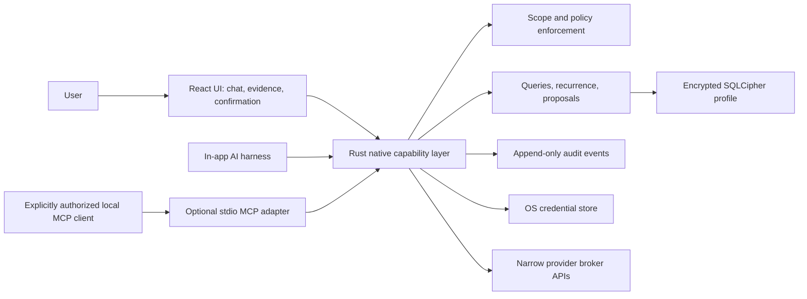
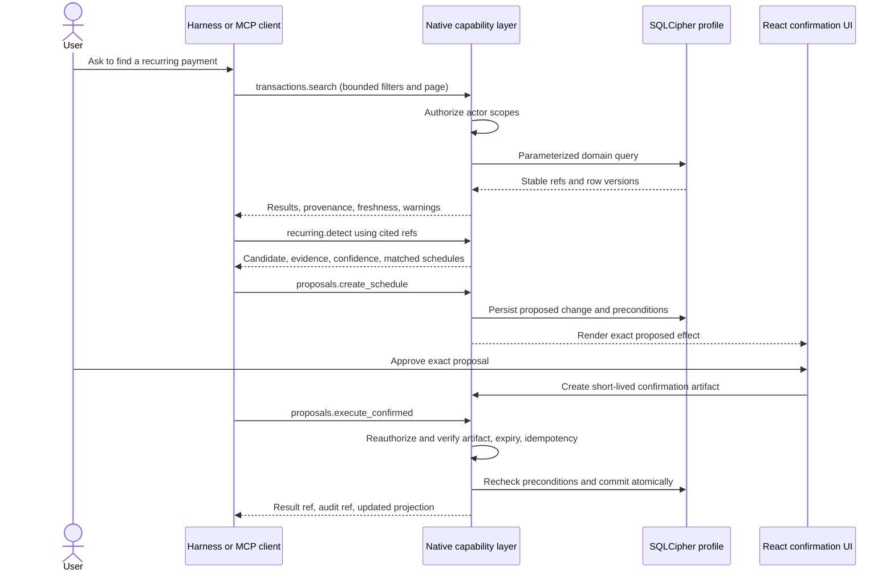

# Money Map AI capability architecture

Status: native recurring-bill vertical slice implemented through Linear ID-113
Contract generation: `docs/ai-tools/schemas/v1/`

## Security and ownership boundary

Money Map's Rust/Tauri process owns the capability registry, authorization, domain queries, proposal lifecycle, audit records, SQLCipher connection, and OS credential access. React renders conversations, cited evidence, and native confirmation prompts. It never receives database keys or provider tokens.

An optional stdio MCP adapter translates MCP calls into the same in-process capability requests. It has no SQL or shell facility. It starts disabled, requires an explicit local profile and actor grant, and defaults to read and propose scopes. Provider brokers remain separate network integrations and are not exposed as general-purpose AI tools.

## Request and data flow

Every response identifies the contract and capability versions. Financial values use ISO currency plus integer minor units. Records use opaque typed references; callers must not infer database layout from IDs. Derived results cite evidence, disclose assumptions, and report freshness. Pagination is bounded and cursor-based. Additive provider or future-standard mappings belong in `extensions`, while canonical fields remain provider-neutral.

## Threat model

| Threat | Boundary or mitigation |
| --- | --- |
| Prompt injection requests secrets, SQL, shell, or hidden records | Registry exposes typed finance capabilities only; native authorization checks every request; secrets and raw SQL are never capability results. |
| A client escalates from reading to mutation | Actor grants carry explicit scopes. Proposal, confirmation, and execution are separate scopes and native operations. |
| Confused-deputy execution | Confirmation artifacts bind actor, profile, proposal version, effect digest, and expiry. Execution rechecks all bindings. |
| Replay or duplicate mutation | Caller supplies an idempotency key; native storage records the outcome and returns it for exact replays. |
| Stale or concurrently changed financial state | Proposals contain record-version preconditions. Execution verifies them inside the write transaction. |
| Over-broad disclosure | Search requires bounded page sizes and supports account/date/source filters. Results are minimized and scoped to the active local profile. |
| Provider payload or ontology coupling | Adapters map external data into canonical records; provider details are optional extensions, never required identifiers. |
| MCP network exposure | First adapter is opt-in stdio only. No listening socket or remote transport is part of this decision. |
| Production/Sandbox crossover | Existing compile-time environment boundaries apply to the capability registry and adapter; production never registers Sandbox operations. |
| Fabricated inference | Derived candidates include evidence refs, observations, confidence, assumptions, warnings, and freshness metadata. |
| Sensitive logs | Audit events store capability, actor, refs, decisions, and outcome metadata; request/result bodies and secrets are redacted by default. |

## Capability rules

1. Registry discovery is the only supported way to learn available tools and versions.
2. Reads return bounded evidence. Callers follow cursors rather than requesting an unbounded ledger.
3. Derived facts never replace observations; they cite them.
4. A schedule proposal is inert. Only a current, native-confirmed proposal may execute.
5. External financial effects such as transfers, payments, trades, messages, and provider connection changes are outside the first capability set.
6. Compatibility is additive within a major schema version. Breaking changes require a new schema path and capability major version.

## Initial implementation seams

- Rust domain module: typed capability request/response values independent of Tauri and MCP.
- Authorization module: profile-bound actor grants and scope evaluation.
- Proposal module: persistence, state transitions, effect digest, precondition checks, idempotency, and audit.
- Tauri commands: thin serialization adapters for the React harness.
- stdio MCP binary or subcommand: descriptor generation plus request translation to the native layer.
- CI: JSON Schema validation, fixtures, compatibility checks, redaction tests, and mutation-safety assertions.

The implemented schedule mutation protocol and its downstream UI contract are documented in [`PROPOSAL-LIFECYCLE.md`](PROPOSAL-LIFECYCLE.md).
